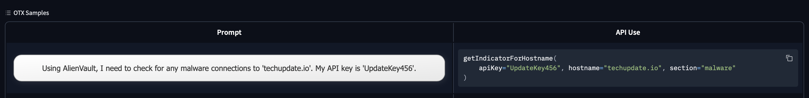
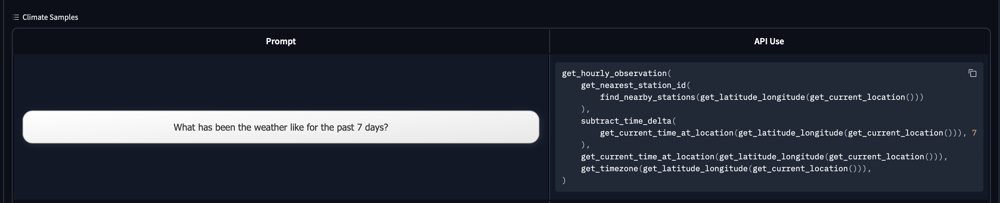
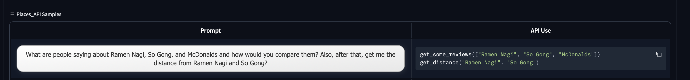
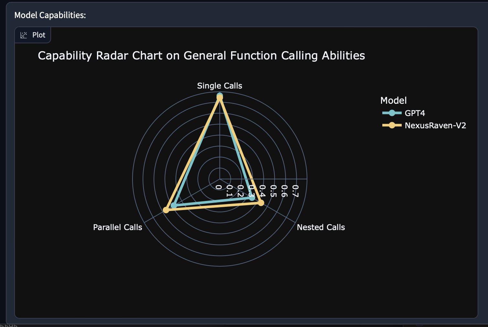
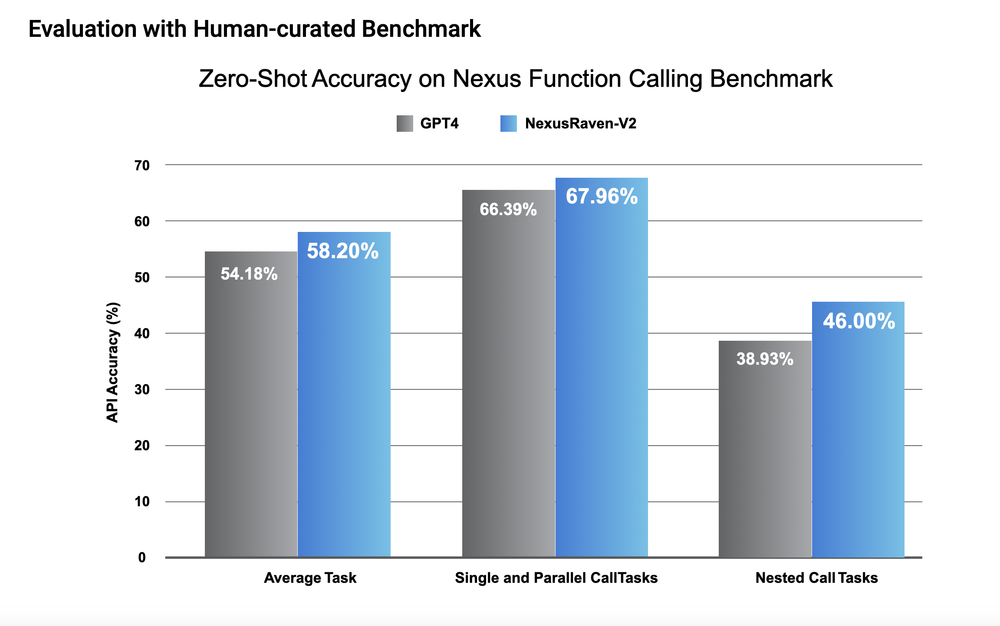

# NexusRaven-V2
### Pushing The Boundaries of Open Source Function Calling Models

[](CODE_LICENSE)

[](https://www.python.org/downloads/release/python-3100/)

<p align="center">
<a href="https://nexusflow.ai" target="_blank">Nexusflow Website</a> - <a href="https://nexusflow.ai/blogs/ravenv2" target="_blank">NexusRaven-V2 blog post</a> - <a href="https://huggingface.co/Nexusflow/NexusRaven-V2-13B" target="_blank">NexusRaven-V2-13B</a> 
</p>

<p align="center" width="100%">
<a></a>
</p>

Welcome to NexusRaven-V2! We want to provide the evaluation data, evaluation code, and a prompting guide to help you reproduce our results, as well as use NexusRaven-V2 to the best of its ability! 

## Introducing NexusRaven-V2
NexusRaven-V2 is an open-source and commercially viable function calling LLM that surpasses the state-of-the-art in function calling capabilities. It has 13B parameters. NexusRaven-V2 is capable of doing single function calls, parallel function calls (where multiple \"disconnected\" function calls are necessary to answer the user query), and nested function calls (where the argument for the necessary function requires a chain of other function calls). 

💪 **Versatile Function Calling Capability**: NexusRaven-V2 is capable of generating single function calls, nested calls, and parallel calls in many challenging cases. 

🤓 **Fully Explainable**: NexusRaven-V2 is capable of generating very detailed explanations for the function calls it generates. This behavior can be turned off, to save tokens during inference.

📊 **Performance Highlights**: NexusRaven-V2 surpasses GPT-4 by up to 7% in function calling success rates in human-generated use cases involving nested and composite functions.

🔧 **Generalization to the Unseen**: NexusRaven-V2 has never been trained on the functions used in evaluation.

🔥 **Commercially Permissive**: The training of NexusRaven-V2 does not involve any data generated by proprietary LLMs such as GPT-4. You have full control of the model when deployed in commercial applications.

Please checkout the following links!
- [Prompting Notebook CoLab](https://colab.research.google.com/drive/19JYixRPPlanmW5q49WYi_tU8rhHeCEKW?usp=sharing)
- [Evaluation Leaderboard](https://huggingface.co/spaces/Nexusflow/Nexus_Function_Calling_Leaderboard)
- [NexusRaven-V2 Real-World Demo](https://huggingface.co/spaces/Nexusflow/NexusRaven-V2-Demo)

## NexusRaven-V2 model usage

NexusRaven-V2 accepts a list of python functions. These python functions can do anything (including sending GET/POST requests to external APIs!). The two requirements include the python function signature and the appropriate docstring to generate the function call. 

### NexusRaven-V2's Capabilities

NexusRaven-V2 is capable of generating deeply nested function calls, parallel function calls, and simple single calls. It can also justify the function calls it generated. If you would like to generate the call only, please set a stop criteria of "<bot_end>". Otherwise, please allow NexusRaven-V2 to run until its stop token (i.e. "\<\/s\>").

### Quick Start Prompting Guide

Please refer to our notebook, [How-To-Prompt.ipynb](How-To-Prompt.ipynb), for more advanced tutorials on using NexusRaven-V2!

### Quickstart
You can run the model on a GPU using the following code. 
```python
# Please `pip install transformers accelerate`
from transformers import pipeline


pipeline = pipeline(
    "text-generation",
    model="Nexusflow/NexusRaven-V2-13B",
    torch_dtype="auto",
    device_map="auto",
)

prompt_template = \
'''
Function:
def get_weather_data(coordinates):
    """
    Fetches weather data from the Open-Meteo API for the given latitude and longitude.

    Args:
    coordinates (tuple): The latitude of the location.

    Returns:
    float: The current temperature in the coordinates you've asked for
    """

Function:
def get_coordinates_from_city(city_name):
    """
    Fetches the latitude and longitude of a given city name using the Maps.co Geocoding API.

    Args:
    city_name (str): The name of the city.

    Returns:
    tuple: The latitude and longitude of the city.
    """

User Query: {query}<human_end>

'''

prompt = prompt_template.format(query="What's the weather like in Seattle right now?")

result = pipeline(prompt, max_new_tokens=2048, return_full_text=False, do_sample=False, temperature=0.001)[0]["generated_text"]
print (result)
```

This should generate the following:
```
Call: get_weather_data(coordinates=get_coordinates_from_city(city_name='Seattle'))<bot_end>
Thought: The function call `get_weather_data(coordinates=get_coordinates_from_city(city_name='Seattle'))` answers the question "What's the weather like in Seattle right now?" by following these steps:

1. `get_coordinates_from_city(city_name='Seattle')`: This function call fetches the latitude and longitude of the city "Seattle" using the Maps.co Geocoding API.
2. `get_weather_data(coordinates=...)`: This function call fetches the current weather data for the coordinates returned by the previous function call.

Therefore, the function call `get_weather_data(coordinates=get_coordinates_from_city(city_name='Seattle'))` answers the question "What's the weather like in Seattle right now?" by first fetching the coordinates of the city "Seattle" and then fetching the current weather data for those coordinates.
```

If you would like to prevent the generation of the explanation of the function call (for example, to save on inference tokens), please set a stopping criteria of "<bot_end>". 

Please follow this prompting template to maximize the performance of RavenV2. 


### Using with OpenAI FC Schematics

[If you currently have a workflow that is built around OpenAI's function calling and you want to try NexusRaven-V2, we have a package that helps you drop in NexusRaven-V2.](https://github.com/nexusflowai/nexusraven-pip)

Please give it a try!

## NexusRaven-V2 on Nexus Function Calling Benchmark

### Benchmarks

We curated 9 tasks within the Nexus Function Calling Benchmark specifically around function calling. We release 8 of them, but keep one internally to avoid situations where new community models overfit to these benchmarks.

They are based on real-world APIs. Here are the 8 datasets for evaluation:

[The function definitions for all benchmarks can be found here](https://huggingface.co/datasets/Nexusflow/Function_Call_Definitions).

- <a href="https://huggingface.co/datasets/Nexusflow/NVDLibraryBenchmark" target="_blank"> NVDLibrary </a>
- <a href="https://huggingface.co/datasets/Nexusflow/VirusTotalBenchmark" target="_blank"> VirusTotal </a>
- <a href="https://huggingface.co/datasets/Nexusflow/OTXAPIBenchmark" target="_blank"> OTX </a>
- <a href="https://huggingface.co/datasets/Nexusflow/PlacesAPIBenchmark" target="_blank"> Places API </a>
- <a href="https://huggingface.co/datasets/Nexusflow/ClimateAPIBenchmark" target="_blank"> Climate API </a>
- <a href="https://huggingface.co/datasets/Nexusflow/VirusTotalMultiple" target="_blank"> VirusTotal-Parallel Calls </a>
- <a href="https://huggingface.co/datasets/Nexusflow/VirusTotalMultiple" target="_blank"> VirusTotal-Nested Calls </a>
- <a href="https://huggingface.co/datasets/Nexusflow/CVECPEAPIBenchmark" target="_blank"> NVDLibrary-Nested Calls </a>

We report accuracy on The Stack API but do not release the data. We keep it internal as a means of benchmarking new models to ensure generalizability.

### Benchmark Classifications
We classify the benchmarks above into three categories, based on the type of API usage they require to get the answer correctly. These include: single calls, parallel calls, and nested calls.

#### Single Calls
Single Calls are defined as API usage that only require a single function call. Here is an example of this:

<p align="center" width="100%">
<a></a>
</p>

#### Nested Calls
Nested Calls are defined as API usage that require multiple calls all at once to get the right answer, where the argument for the outer call depends on the call graph. Here is an example of this:

<p align="center" width="100%">
<a></a>
</p>

#### Parallel Calls

Parallel calls are when seperate calls are generated, but they do not connect into each other. 

<p align="center" width="100%">
<a></a>
</p>

#### Task Classification

We classify the tasks within Nexus Function Calling Benchmark into the following categories:
<div align="center">

| API                 | Category                  |
|---------------------|---------------------------|
| OTX                 | Single Calls              |
| NVDLibrary          | Single Calls              |
| VirusTotal          | Single Calls              |
| VirusTotal-Nested Calls | Nested Calls            |
| Climate             | Nested and Parallel Calls |
| VirusTotal-Parallel Calls | Parallel Calls        |
| Places API          | Nested Calls              |
| NVDLibrary-Nested Calls | Nested Calls            |
| The Stack API       | Mostly Single Calls   |
</div>

### NexusRaven-V2 Capability Breakdown

We benchmark NexusRaven-V2 against GPT4 primarily. Our benchmarking effort consists of several categories of benchmarks. This includes: single calls, parallel calls, and nested calls. 

#### Capability Performance

The performance of NexusRaven-V2 on each category is reflected below:
<p align="center" width="100%">
<a></a>
</p>

### Overall Scores
<p align="center" width="100%">
<a></a>
</p>

### Reproducing The Results
Please see the [Benchmarking Notebook](evaluation_notebook/Benchmark_Models.ipynb) for reproducing Raven's results. The cells have already been run and the output has been recorded in the notebook itself. The output of each cell is what we report in the leaderboard. However, you are welcome to rerun the cells to verify. The NexusRaven-V2 endpoint will be accessible for this effort, and the link is present in the notebook itself.

NexusRaven-V2's benchmark performance should be identical to the reported accuracy in leaderboard.

**IMPORTANT NOTE:** However, it is currently impossible to generate deterministic outputs for GPT4, so we see WILD swings in the per-task accuracy for GPT4 (but, the average accuracy across task categories are relatively stable within a few percent). Please note this when rerunning the GPT4 cells in the notebook.

## License
The code in this repository for running the NexusRaven-V2 model, the evaluation notebook, the prompting notebook, and the evaluation data are licensed under [Apache 2.0](CODE_LICENSE). 

## References
We thank the CodeLLaMa Team for their great foundational models that made NexusRaven-V2 possible.

```
@misc{rozière2023code,
      title={Code Llama: Open Foundation Models for Code}, 
      author={Baptiste Rozière and Jonas Gehring and Fabian Gloeckle and Sten Sootla and Itai Gat and Xiaoqing Ellen Tan and Yossi Adi and Jingyu Liu and Tal Remez and Jérémy Rapin and Artyom Kozhevnikov and Ivan Evtimov and Joanna Bitton and Manish Bhatt and Cristian Canton Ferrer and Aaron Grattafiori and Wenhan Xiong and Alexandre Défossez and Jade Copet and Faisal Azhar and Hugo Touvron and Louis Martin and Nicolas Usunier and Thomas Scialom and Gabriel Synnaeve},
      year={2023},
      eprint={2308.12950},
      archivePrefix={arXiv},
      primaryClass={cs.CL}
}
```


## Citation
```
@misc{nexusraven,
      title={NexusRaven-V2: Surpassing GPT-4 for Zero-shot Function Calling},
      author={Nexusflow.ai team},
      year={2023},
      url={https://nexusflow.ai/blogs/ravenv2}
}
```

## Contact
Please join our [Discord Channel](https://discord.gg/HDSVmNAs3y) to reach out for any issues and comments!

